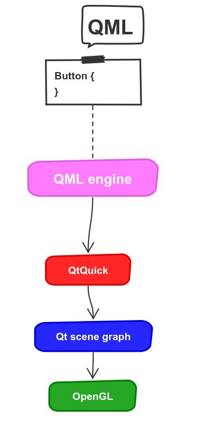

theme: QtDay 2019
footer: [https://github.com/uwerat/qskinny](https://github.com/uwerat/qskinny)


# [fit] Using the Qt Scene Graph
# [fit] from C++ with QSkinny

---

# Who am I?

- working on Qt since 2008
- former QtNetwork maintainer
- [@peha23](https://twitter.com/peha23) on Twitter

---

# What is this talk about?

Using the Qt graphic stack from C++

^ Why?
-> C++ bindings
-> QtWidgets familiarity
-> Qt for Python
What to take away from this presentation?
-> What is missing in Qt right now
-> How QSkinny looks
-> How a combined effort could look like

---

# Agenda

1. QML under the hood
1. The QML / C++ boundary
1. QSkinny
1. Outlook

---

# Agenda

1. **QML under the hood**
1. The QML / C++ boundary
1. QSkinny
1. Outlook

---

# QML under the hood



---

# Types of scene graph nodes


^ Don't remember all the details, just this: All QML objects are broken down into a set of scene graph nodes

---

# QML example

```
Rectangle {
    id: outterRectangle
    width: 200
    height: 200
    color: "red"
    opacity: 0.5

    Rectangle {
        id: innerRectangle
        width: 50
        height: 50
        clip: true
        anchors.bottom: parent.bottom
        anchors.right: parent.right
        color: "green"
    }
}
```


---

# Agenda

1. QML under the hood
1. **The QML / C++ boundary**
1. QSkinny
1. Outlook

---


^ each QML object is a QObject (or QGadget)
might be not fine-grained enough for gradient stops / speedometer ticks etc.

---

# QtQuickControls 1

Write everything in QML

```
Control {
    id: slider
    (...)
    style: Settings.styleComponent(Settings.style, "SliderStyle.qml", slider)
    property Component tickmarks: Repeater {
    Rectangle {
        color: "#777"
        width: 1
        height: 3
        y: (...)
        x: (...)
        }
    }
}
```

^ problem: too slow
has been abandoned by now
too many QObjects created (see e.g. tickmarks above)

---

# QtQuickControls 2

some parts QML, some C++

```c++
qquickslider_p.h:

class Q_QUICKTEMPLATES2_PRIVATE_EXPORT QQuickSlider : public QQuickControl
{
    Q_OBJECT
    Q_PROPERTY(qreal from READ from WRITE setFrom NOTIFY fromChanged FINAL)
    Q_PROPERTY(qreal to READ to WRITE setTo NOTIFY toChanged FINAL)
    (...)
};

Slider.qml:

T.Slider {
    id: control
}
```

^ problem: 1. private API
2. font / palette / locale cannot inherited for user types
-> creates boundary: Qt code C++, user code QML. Was not designed with extensibility in mind
user defined controls cannot be written in C++

---

# Agenda

1. QML under the hood
1. The QML / C++ boundary
1. **QSkinny**
1. Outlook

^ big question: Why not make QQC2 public and let people inherit?
-> there are some more differences which we will see soon

---


^ QSkinny and QML both use QtQuick -> they could be mixed and matched,
and there are examples for that
QSkinny makes QML optional though (and in one project there is no QML)
code-wise it looks like Widgets code (we will see an example later), but is
hardware accelerated just like QML

---

# QSkinny design goals

- lightweight
- flexible theming
- dynamic sizing

^lightweight: don't create unnecessary QObjects or QQuickItems / cache items / don't create scene graph nodes until they are necessary (e.g. QML creates all nodes even if they are outside of the bounding rectangle)
theming: QStyle not enough / separate content from theming
dynamic sizing: vector graphics / layouts. Why dynamic sizing? screens on embedded are fixed, but layouts need to be resized e.g. when changing theme / language, or switching to another physical screen size. Vector graphics allow for size adaptations (widthForHeight() etc.)

---

# QSkinny API

```c++
    QskWindow window;
    auto box = new QskLinearBox(Qt::Vertical);
    auto button = new QskPushButton("push me", box);
    auto label = new QskTextLabel("label", box);
    window.addItem(box);
    window.show();
```


---

# separation of content and style

(here diagram of skinlet etc.)

---

# example


---

# example


---

# Outlook

##QSkinny

polishing / documentation

##Qt 6

(maybe) new styling / opening up QtQuickControls 2?

---

# Discussion


[@peha23](https://twitter.com/peha23) on Twitter
