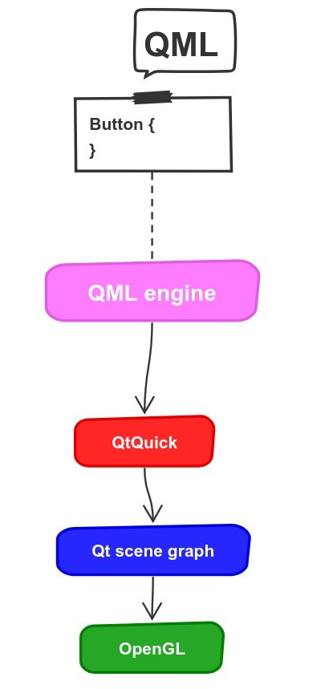

footer: my footer


# [fit] Using the Qt Scene Graph
# [fit] from C++ with QSkinny

---

# Who am I?

- working on Qt since 2008
- former QtNetwork maintainer
- [@peha23](https://twitter.com/peha23) on Twitter

---

# What is this talk about?

Using the Qt graphic stack from C++

^ C++ bindings
QtWidgets familiarity
Qt for Python

---

# Agenda

1. *QML under the hood*
1. The QML / C++ boundary
1. QSkinny
1. Outlook

---

# QML under the hood



---

# What happens when instantiating a "Rectangle { }"

---

# The QML / C++ boundary

---

# QtQuickControls 1

Write everything in QML

^ problem: too slow
has been abandoned by now
too many QObjects created

---

# QtQuickControls 2

Write most things in C++ and some in QML
User code still only QML

^ problem: 1. private API
2. font / palette / locale not inherited for user types
-> creates boundary: Qt code C++, user code QML
user defined controls cannot be written in C++

---

# QSkinny

^ options back then: 1. modify Qt code
2. write own library
3. mix QQC1 / QQC2 / Skinny somehow

---

# QSkinny design goals

1. lightweight
1. flexible theming
1. dynamic sizing

^lightweight: don't create unnecessary QObjects / QQuickItems, cache items
theming: QStyle not enough
dynamic sizing: vector graphics / layouts

---

# QSkinny API

```c++
    QskWindow window;
    auto box = new QskLinearBox(Qt::Vertical);
    auto button = new QskPushButton("push me", box);
    auto label = new QskTextLabel("label", box);
    window.addItem(box);
    window.show();
```

---

# Outlook

What about Qt 6?

---

# Discussion


### [@peha23](https://twitter.com/peha23) on Twitter